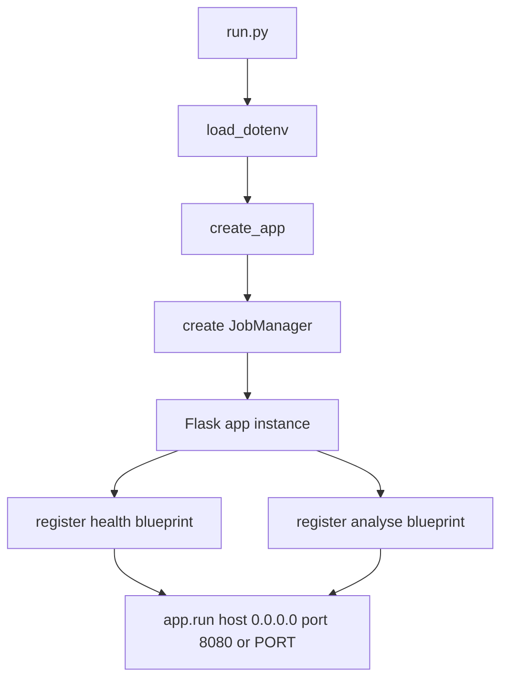
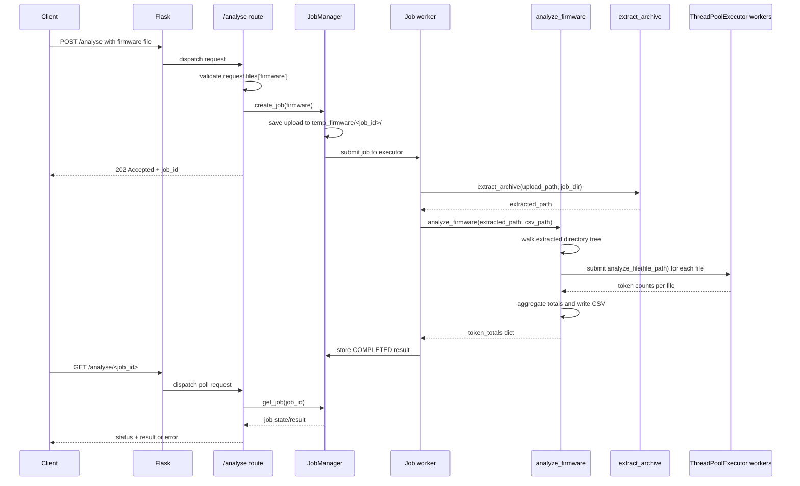

# Firmware Analyzer Architecture

## 1. Purpose and Scope

This document describes the implemented architecture of the Firmware Analyzer application in this repository. It focuses on:

- runtime structure and component responsibilities
- the end-to-end request and analysis flow
- concurrency and file-processing behavior
- deployment and test surfaces
- gaps between the requested requirements and the current implementation

The functional requirements originate from `docs/requirements.md`. This document intentionally distinguishes between the target behavior and the behavior currently present in code.

## 2. System Overview

The application is a small Flask-based HTTP service that accepts an uploaded firmware archive, creates a background analysis job, extracts the archive into a job-specific temporary directory, scans the extracted files for authentication tokens, writes detailed findings to a CSV file, and returns aggregated token counts through a polling endpoint.

At a high level, the system has four layers:

1. Application bootstrap layer
2. HTTP route layer
3. Job orchestration layer
4. Firmware analysis service layer

The design is intentionally simple. The route layer performs request parsing and job submission, the job manager owns in-memory job state and background execution, and the service layer owns archive extraction, file traversal, token scanning, aggregation, and CSV generation.

## 3. Architectural Style

The code follows a lightweight layered architecture:

- `run.py` starts the process and creates the Flask application.
- `app/__init__.py` builds the application instance, creates the job manager, and registers routes.
- `app/routes/*.py` expose HTTP endpoints.
- `app/services/job_manager.py` owns the in-memory job registry and background worker execution.
- `app/services/analyser.py` contains the file-scanning business logic.
- `app/tests/test_analyser.py` validates route-level behavior using Flask's test client.

This is not a domain-rich architecture with repositories, models, or persistence layers. The application is effectively a thin HTTP wrapper around an async file-scanning engine.

## 4. Repository Structure

```text
Firmware_analyzer/
|-- run.py
|-- Dockerfile
|-- requirements.txt
|-- pytest.ini
|-- app/
|   |-- __init__.py
|   |-- routes/
|   |   |-- health.py
|   |   `-- analyse.py
|   |-- services/
|   |   |-- job_manager.py
|   |   `-- analyser.py
|   |-- tests/
|   |   |-- test_analyser.py
|   |   `-- fixtures/
|   |       |-- test_firmware.tar
|   |       `-- test_firmware.zip
|   `-- test.py
`-- docs/
    |-- requirements.md
    `-- architecture.md
```

## 5. Main Components

### 5.1 Process Entry Point

`run.py` is the runtime entry point used by both local execution and the Docker container command.

Responsibilities:

- load environment variables via `python-dotenv`
- create the Flask application by calling `create_app()`
- determine the listening port from `PORT`, defaulting to `8080`
- run the Flask development server bound to `0.0.0.0`

This means the application currently uses Flask's built-in server rather than a production WSGI server such as Gunicorn or Waitress.

### 5.2 Application Factory

`app/__init__.py` defines:

- `register_routes(app)`
- `create_app()`

Responsibilities:

- instantiate the Flask application
- create the in-memory job manager and store it on `app.extensions`
- register the health and analysis blueprints

This file acts as the composition root. No dependency injection container or configuration object is used. The job manager is shared through `app.extensions`, and service dependencies are imported directly inside the route modules.

### 5.3 Health Endpoint

`app/routes/health.py` exposes a single GET endpoint:

- `GET /health`

Responsibilities:

- return a simple JSON heartbeat response: `{"status": "ok"}`

This endpoint does not verify downstream dependencies because the application has no database, queue, or external service integration.

### 5.4 Analysis Endpoint

`app/routes/analyse.py` exposes the primary API endpoint:

- `POST /analyse`
- `GET /analyse/<job_id>`

Responsibilities:

- read the uploaded file from multipart form-data under the field name `firmware`
- validate that a file was provided
- create and submit a background job
- return a `job_id` immediately
- let clients poll job status and final results
- return `404` when a job ID is unknown
- return `500` when the job has failed

This endpoint is thin by design. Most behavior is delegated to the service layer.

### 5.5 Analysis Service

`app/services/analyser.py` contains the core business logic.

Functions:

- `analyze_file(file_path)`
- `analyze_firmware(directory_path, csv_output_path)`
- `is_archive(file_path)`
- `extract_archive(archive_path, extract_to='outputs')`

Responsibilities:

- identify tokens using a compiled regular expression
- scan each file line by line using UTF-8 with `errors='ignore'`
- parallelize file scanning with `ThreadPoolExecutor`
- produce per-file CSV rows
- produce total token counts across the full extracted tree
- recursively extract nested archives of supported types

### 5.6 Job Manager Service

`app/services/job_manager.py` contains the async orchestration layer.

Responsibilities:

- create unique job identifiers
- save uploads into `temp_firmware/<job_id>/`
- register jobs in an in-memory dictionary
- submit background work to a `ThreadPoolExecutor`
- update job status from `PENDING` to `RUNNING`, `COMPLETED`, or `FAILED`
- expose lookup helpers for polling routes

The job manager owns the async request lifecycle, while the analyzer service remains focused on file processing.

## 6. Data and Control Flow

### 6.1 Startup Flow



### 6.2 Request Handling Flow



## 7. Detailed Component Behavior

### 7.1 Token Detection Logic

The token detection pattern is:

```text
<Tkn\d{3}[A-Z]{5}Tkn>
```

This matches:

- literal prefix `<Tkn`
- exactly 3 digits
- exactly 5 uppercase English letters
- literal suffix `Tkn>`

Example:

```text
<Tkn435JFIRKTkn>
```

The pattern is compiled once at module import time and reused across all scans.

### 7.2 Single File Analysis

`analyze_file(file_path)`:

- opens the file in text mode
- decodes as UTF-8 with invalid characters ignored
- scans each line for token matches
- returns a dictionary of `token -> count` for that file only

Important behavior:

- binary files are not specially detected; they are opened as text and partially decoded
- unreadable byte sequences are silently discarded due to `errors='ignore'`
- counts are line-agnostic and position-agnostic; only total occurrences per token per file are retained

### 7.3 Directory Analysis

`analyze_firmware(directory_path, csv_output_path)` performs the main aggregation.

Steps:

1. Walk the extracted directory tree and collect all file paths.
2. Submit one worker task per file to a `ThreadPoolExecutor`.
3. Wait for tasks to complete using `as_completed`.
4. Convert each file path to a relative path from the analysis root.
5. Normalize path separators to `/` for CSV output consistency.
6. Build CSV rows as `(relative_path, token, count)`.
7. Accumulate global token totals in memory.
8. Sort rows by `(Path, Occurrences, Token)`.
9. Write the CSV header and rows.
10. Return the global totals as a dictionary.

The return value is the JSON payload later returned by the HTTP route.

### 7.4 Archive Extraction

`extract_archive(archive_path, extract_to='outputs')` supports:

- `.zip`
- `.tar`
- `.tar.gz`
- `.tgz`

Behavior:

- create a target extraction directory based on the archive filename without extension
- extract the top-level archive into that directory
- recursively scan the extracted tree for nested archives
- extract nested archives into the same root extraction directory
- continue until no unprocessed archives remain

This makes nested archive contents visible to the scanner without requiring the route layer to understand archive depth.

## 8. Concurrency Model

The application uses concurrency only inside the file-scanning service.

### 8.1 Current Model

- request handling is synchronous from the client's perspective
- archive extraction runs in the request thread
- file analysis is parallelized with `ThreadPoolExecutor`
- results are aggregated in the request thread after worker completion

### 8.2 Why Threads Help Here

The current workload is dominated by filesystem reads and regex scanning. Threading can improve throughput for many files because file I/O can overlap.

### 8.3 Asynchronous Job-Based Analysis

The application now supports asynchronous firmware analysis. Clients submit a firmware archive, receive a job identifier immediately, and poll a status endpoint until the job completes.

Implemented async behavior:

- `POST /analyse` starts a background analysis job
- a thread-safe in-memory job registry stores job state
- each job has a unique `job_id`
- job execution runs in a background thread pool
- `GET /analyse/<job_id>` returns the current status
- completed jobs return the token totals in the polling response
- failed jobs return an error message
- job-specific temporary directories prevent collisions between concurrent requests

Current lifecycle:

- `PENDING` when the job is accepted
- `RUNNING` while extraction and scanning are in progress
- `COMPLETED` when analysis succeeds
- `FAILED` when extraction or analysis raises an exception

This design keeps request submission fast while allowing long-running scans to finish in the background.

## 9. Generated Artifacts

For each successful analysis request, the system generates:

- a saved uploaded archive in `temp_firmware/<job_id>/<firmware_name>`
- an extracted directory under `temp_firmware/<job_id>/`
- a CSV report at `temp_firmware/<job_id>/output.csv`
- an in-memory Python dictionary stored in the job registry and returned through polling

The cleanup mechanism removes the uploaded archive and extracted folders after a job finishes, while preserving `output.csv` as the retained disk artifact for that job.

Example async API payloads:

- submit response: `{"job_id": "...", "message": "Firmware analysis started"}`
- polling response while running: `{"job_id": "...", "status": "running", "message": "Analysis in progress"}`
- polling response when completed: `{"job_id": "...", "status": "completed", "result": {...}}`
- polling response when failed: `{"job_id": "...", "status": "failed", "error": "..."}`

Example CSV columns:

- `File Path`
- `Token`
- `Occurrences`

The JSON response contains only aggregate totals by token, not the detailed per-file rows.

## 10. Error Handling and Operational Characteristics

### 10.1 Implemented Error Handling

The route explicitly handles one validation case:

- missing `firmware` file returns HTTP 400 with JSON error

Additional async handling is also implemented:

- unknown `job_id` returns HTTP 404 with JSON error
- failed jobs return HTTP 500 with the stored error message

### 10.2 Unhandled Failure Modes

The following failures are not explicitly handled and would likely surface as HTTP 500 errors:

- invalid or corrupted archives
- filesystem permission failures
- disk space exhaustion
- process restart wiping the in-memory job registry
- unexpected exceptions during extraction or CSV writing
- malformed nested archives during recursive extraction

### 10.3 Temporary File Lifecycle

Temporary files are created per job, and the job manager now removes the upload and extraction folders after job completion.

Implications:

- repeated requests only retain the final `output.csv` per job
- long-running deployments still need a retention policy for completed job records and retained CSV files
- a process restart loses all pending or completed job state because the registry is in memory only

## 11. Testing Architecture

The current automated coverage is route-oriented and uses Flask's test client.

Implemented tests:

- request without file returns 400
- async ZIP firmware submission returns 202 and provides a `job_id`
- async TAR firmware submission returns 202 and provides a `job_id`
- polling an unknown job returns 404
- polling a submitted job eventually returns `completed` or `failed`

The tests verify:

- application bootstrapping works
- route wiring works
- job submission works without blocking the request
- archive extraction and token scanning work for the included fixtures
- polling can retrieve status and final results from the in-memory registry

## 12. Deployment View

The repository includes a Dockerfile based on `python:3.11-slim`.

Container flow:

1. set `/app` as the working directory
2. copy `requirements.txt`
3. install dependencies with `pip`
4. copy the repository contents
5. expose port `8080`
6. start the service with `python run.py`

Runtime dependencies listed in `requirements.txt` include Flask, python-dotenv, pytest, and several transitive packages. `Flask-SQLAlchemy` and `SQLAlchemy` are present in dependencies but are not used by the current application code.

Operationally, the async job registry is process-local. A container restart clears all jobs, so this implementation is best suited to short-lived analysis jobs or single-process deployments.

## 13. Design Observations

### 13.1 Strengths

- small and easy-to-follow codebase
- clear separation between route handling, async orchestration, and scanning logic
- practical end-to-end tests using real archive fixtures
- recursive archive extraction supports nested packaging scenarios
- CSV output and JSON aggregation satisfy the primary analysis use case
- per-job temporary directories avoid collisions between concurrent requests

### 13.2 Constraints and Risks

- async jobs are in-memory only and are lost on process restart
- no cleanup or retention control for generated artifacts
- no production-grade web server configuration
- text decoding strategy may skip token-like data embedded in non-text file formats
- archive extraction uses standard library extraction directly, with no explicit path traversal hardening
- background worker failures must be caught and stored in job state to avoid silent loss of analysis results

## 14. Requirements Alignment

### 14.1 Implemented

- token scanning across an extracted directory tree
- CSV report generation
- JSON aggregate totals
- multithreaded file analysis
- Flask HTTP endpoint for async archive upload and polling
- support for ZIP and TAR family archives
- in-memory async job registry with job status tracking

<!-- ### 14.2 Partially Implemented

- archive handling is implemented and extended to nested archives, although this was not fully specified in the original requirements
- sorting is implemented in the service, but current tests do not validate it
- CSV download over HTTP is not shown in the current tests

### 14.3 Not Implemented

- persistent job storage across process restarts
- explicit operational controls for large scans, cleanup, and request retention -->

## 15. Recommended Evolution Path

If this application is extended toward production or toward full requirement completion, the most valuable next architectural steps are:

1. add cleanup and retention policies for extracted artifacts and CSV outputs
2. persist job state if cross-restart durability is needed
3. harden archive extraction and filesystem error handling
4. add service-level tests for CSV content, nested archives, and failure cases
5. add optional CSV download over HTTP if the API should expose the generated report directly
6. replace the development server with a production WSGI server in container deployments

## 16. Summary

The current Firmware Analyzer is a compact Flask service wrapped around an async job manager and a multithreaded file-scanning engine. The implemented design is straightforward: a client uploads an archive, the server creates a job, the worker extracts it, the service scans files concurrently for a specific token pattern, writes a CSV report, and polling returns the aggregate token counts and final status.

The architecture now satisfies the asynchronous requirement from the original specification. The main operational risks are in-memory job volatility across restarts, lack of cleanup, and minimal error handling around archive and filesystem operations.